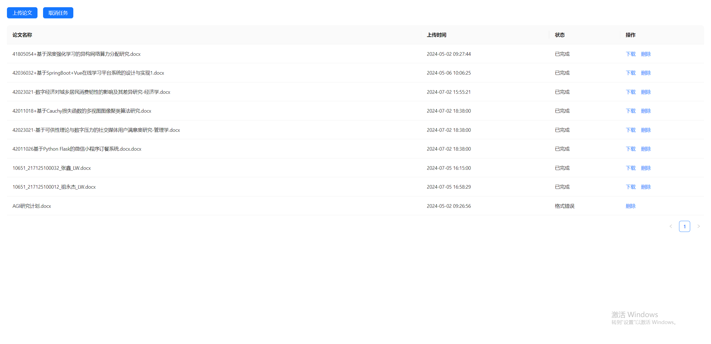

# 论文格式检查与修改项目

## 介绍

本项目是一个用于上传论文进行格式检查以及错别字、病句、语法修改的系统。项目基于Flask框架开发后端接口，并利用大型语言模型（如GPT-4）进行文本分析和修改，旨在帮助用户提高论文的质量和格式的规范性。

## 项目特性

- **格式检查**：自动检查论文格式，确保符合标准要求。
- **错别字修改**：检测并修正论文中的错别字。
- **病句和语法修改**：识别并修改论文中的病句和语法错误。
- **基于大模型**：利用GPT-4等大型语言模型进行高效的文本分析和处理。

## 安装依赖

首先，请确保你已经安装了Python和pip。然后使用以下命令来安装项目所需的依赖库：

```bash
pip install -r requirements.txt
```
## 运行项目
在安装完依赖之后，你可以通过运行main.py来启动项目：

```bash
python main.py
```
## 使用Docker部署MongoDB
如果你还没有安装Docker，请先根据官方文档进行安装。

然后，你可以使用以下命令来部署MongoDB：
```bash
docker pull mongo
docker run -d -p 27017:27017 --name mongodb mongo
```
## 项目运行

该截图展示了用户上传论文后的管理界面。界面主要包括以下几个部分：

上传论文按钮：用户可以通过点击按钮上传新的论文。
取消任务按钮：用户可以取消正在进行的论文处理任务。
论文列表：显示已上传的论文文件，包括文件名、上传时间、状态和操作选项。用户可以下载处理后的文件或删除不需要的文件。



